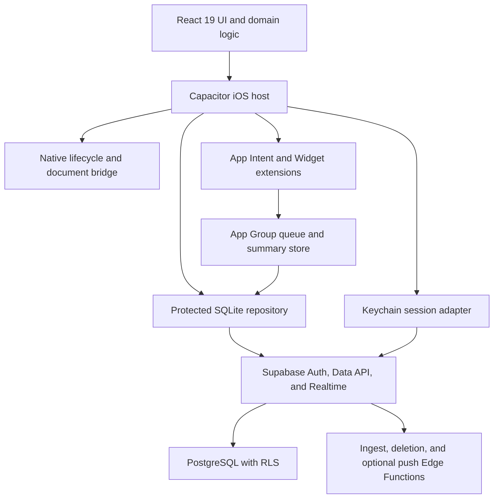

# PWA to Native iOS Migration Audit

**Project:** Budget Tracker  
**Audit date:** 2026-07-15  
**Status:** Planning document only; no migration implementation has begun  
**Relationship to other documents:** Standalone audit. This does not replace or update `PROJECT_IMPROVEMENT_STATUS.md`, `PRODUCT.md`, or the dormant `APP_STORE.md` plan.

## Priority labels

- **Required** — needed for a secure, production-ready App Store release.
- **Strongly recommended** — not an absolute platform requirement, but materially improves review success, native quality, or reliability.
- **Optional** — defer unless a product requirement justifies the additional scope.

## 1. Executive summary

The current PWA is operationally healthy, but the repository is not close to App Store submission because there is no native target, no transferable identity/storage path, and several mandatory account and privacy controls are missing.

Indicative readiness scores:

- **Current PWA operational readiness: 82/100.**
- **Native iOS/App Store readiness: 27/100 — blocked.**

Evidence supporting the PWA assessment:

- 502 unit/integration tests pass across 59 files.
- Coverage passes at 84.5% statements, 77.3% branches, 83.1% functions, and 88.1% lines.
- Lint, Edge Function type-checking, the production build, bundle-size gates, `npm audit --audit-level=high`, and all 10 isolated Playwright journeys pass.
- RLS, explicit database grants, CSP, secret scanning, offline mutation queues, and ingestion deduplication are mature for the project's size.
- The local Supabase Docker stack was unavailable during this audit, so the checked-in RLS suite was not re-run locally. It remains part of CI.

### Recommendation

- **Required:** Adopt **Capacitor 8 with bundled React assets and selective native Swift components**.
- **Required:** Keep Supabase as the backend and source of truth.
- **Required:** Migrate Supabase sessions from browser storage to Keychain and financial/offline state to protected SQLite.
- **Required:** Release a PWA migration bridge before the native app so anonymous users can link an identity and synchronize or export their data.
- **Required:** Add Sign in with Apple, in-app account deletion, privacy/support URLs, a privacy manifest, and complete App Privacy disclosures.
- **Strongly recommended:** Add an App Intent for expense capture, an App Group-backed widget, haptics, local notifications, native document sharing, and native lifecycle handling. These features also mitigate Guideline 4.2 repackaged-website risk.
- **Strongly recommended:** Exclude the poker tracker from public iOS v1, or clearly position it as a non-gambling personal ledger and answer the age-rating questionnaire accordingly.
- **Optional:** Defer remote push and in-app purchases until a real product requirement exists.

The dormant `docs/APP_STORE.md` plan correctly identifies hardware and product risks, but its full SwiftUI/CloudKit recommendation assumes the older Netlify-era architecture. Following it now would discard mature Supabase, shared-budget, ingestion, and test infrastructure rather than migrate the current product.

Estimated effort for one experienced engineer:

- Capacitor hybrid without remote push or subscriptions: **12–16 engineer-weeks**.
- Including production remote push, native widget/App Intents, and full migration hardening: **14–20 engineer-weeks**.
- Apple review time, legal review, and obtaining macOS hardware are outside those estimates.

## 2. Current architecture

### Application

- React 19, TypeScript, Vite 8, and `vite-plugin-pwa`.
- Custom screen/tab state in `src/App.tsx`, without a URL router or native navigation stack.
- Personal entries, shared budgets, poker tracking, data transfer, automatic capture setup, and Sentry error reporting.
- CSS is deliberately dark-only. It has safe-area and reduced-motion handling, but also fixed 10–10.5px labels that do not behave like Dynamic Type.

### Offline and persistence

- Personal entries are server-backed and cached locally.
- Mutations are written optimistically to a local queue and flushed on focus, `online`, `pageshow`, and visibility changes.
- Queue and cache persistence use JSON in browser `localStorage` through `src/syncQueue.ts`, `src/storage.ts`, and `src/userStorage.ts`.
- Export covers personal entries, poker sessions, and local settings, but not the complete shared/account state.
- Corrupt browser data can fall back to empty values without a user-facing recovery workflow or schema-version diagnostics.
- The current queue cannot continue syncing while the PWA is closed.

### Supabase and authentication

- Supabase Auth, PostgreSQL, Realtime, RLS, and Edge Functions are used.
- Personal users begin through anonymous Supabase authentication.
- Shared-budget authentication currently exposes Google only.
- OAuth redirects to `window.location.origin`, which is not suitable for native authentication.
- The default `createClient` browser-storage behavior would place session material in WebView storage if wrapped unchanged.
- Anonymous users lose access after sign-out, cleared browsing data, or moving to a new device unless an identity is linked.

### Database

- RLS is enabled on personal, shared, ingestion-status, and preference tables.
- Personal write policies bind rows to `auth.uid()`.
- Shared inserts require membership and bind attribution to the current user.
- Explicit Data API grants are present.
- Foreign-key and RLS performance indexes exist, and policies use cached `(select auth.uid())` expressions.
- Several business constraints remain client-only: positive/range checks, text lengths, currency values, and some date/category rules.
- Shared members can edit other members' shared entries. This may be intentional for trusted groups, but should be explicitly accepted and regression-tested.

### Background ingestion

- Apple Wallet and DBS email automations send HTTP requests from user-created Shortcuts.
- A custom bearer token is hashed server-side; the service-role key stays inside the Edge Function.
- Apple Pay fallback deduplication uses merchant, amount, and a one-minute window when no stable transaction identifier exists.
- This can merge two legitimate identical purchases in the same minute or duplicate a retry that crosses a minute boundary.
- Rate limiting is an in-memory per-isolate map keyed from forwarded IP headers.
- Request body and text-field size limits are incomplete.

### Browser-specific dependencies

- Workbox precache and an auto-updating service worker.
- `localStorage`, browser download links, browser file inputs, Clipboard API, focus/visibility/online events, browser OAuth redirects, and query-string deep links.
- No camera, microphone, location, contacts, Photos, Apple Pay entitlement, notifications, remote push, or in-app purchases.
- Playwright runs Chromium with an emulated iPhone 13, not WebKit or real iOS.

### Existing positive security controls

- No hardcoded service-role credential was found.
- Ingest tokens are hashed and excluded from client grants.
- RLS and explicit grants are comprehensive.
- CSP, frame restrictions, dependency auditing, full-history gitleaks, and CI gates are present.
- CSV spreadsheet-formula injection is handled.
- The current production bundle is small and has no high-severity npm advisory.

## 3. Recommended migration approach

### Decision: Capacitor 8 hybrid with a selective native layer



### Architecture rules

- **Required:** Package compiled `dist` assets inside the application. Do not load the Vercel website as the app's primary UI.
- **Required:** Disable Workbox/service-worker registration for native builds. The application bundle provides offline assets; SQLite provides offline data.
- **Required:** Put native/web differences behind interfaces such as `StorageRepository`, `AuthSessionStore`, `DocumentService`, `LifecycleService`, and `NotificationService`.
- **Required:** Preserve SGT business-date semantics, entry identifiers, and the current deduplication invariants.
- **Required:** Use App Transport Security defaults, an allowlisted navigation delegate, Universal Links, and system authentication sessions.
- **Required:** Block arbitrary WebView navigation, `javascript:` URLs, unexpected file access, and unknown custom schemes.
- **Strongly recommended:** Target iOS 17 or later for v1, after checking the active users' devices.
- **Strongly recommended:** Launch as iPhone-only until the 430px layout is replaced by an intentional adaptive iPad design.
- **Optional:** Retain the PWA permanently as the web client and migration/export fallback.

### Why not a full SwiftUI rewrite?

A SwiftUI rewrite is reasonable only as a deliberate pivot to an iOS-only, single-user, CloudKit-backed product. It would not preserve:

- Mature shared budgets and Supabase Realtime.
- Existing RLS and server ingestion.
- The 502-test TypeScript suite.
- The web/PWA client.
- Most existing React UI work.

It should therefore be treated as a separate product proposal, not the default migration.

### Migration-option comparison

| Approach | Direct reuse | Indicative effort | Native quality | Maintenance | Main risk |
|---|---:|---:|---|---|---|
| Capacitor + selective Swift | 80–90% of UI/domain logic | 12–20 weeks | Good when native integrations are real | One primary React UI plus a focused Swift layer | Guideline 4.2 if shipped as a plain wrapper |
| React Native/Expo | 30–45% of domain/API logic; little DOM/CSS | 4–7 months | Strong | New UI layer plus native modules | Rebuilding the complete interface and offline layer |
| Flutter | Under 10% direct code reuse | 5–8 months | Strong | Separate Dart application | Nearly complete rewrite and duplicated web strategy |
| SwiftUI | 10–20% conceptual/test-case reuse | 5–8 months | Best platform fit | Native-only codebase | Loss of existing shared/web architecture |
| Remote WKWebView wrapper | Very high superficial reuse | 2–4 weeks | Poor | Appears simple | Offline, security, release control, and App Review risk |

## 4. Compatibility table

| Area | Native status | Treatment |
|---|---|---|
| React screens and calculations | Reusable | **Required:** Retain initially; replace only where native behavior materially improves UX. |
| Existing CSS | Partially reusable | **Required:** Add light mode, scalable typography, landscape/adaptive rules, keyboard avoidance, and accessibility sizing. |
| Workbox/service worker | Incompatible/redundant | **Required:** Disable in native builds. |
| `localStorage` entry cache | Unsafe and not transferable | **Required:** Migrate to protected SQLite. |
| Offline sync queue | Concept reusable | **Required:** Use a transactional SQLite operation table with retry metadata and idempotency keys. |
| Supabase backend and RLS | Reusable | **Required:** Retain; add constraints, deletion, devices, and conflict metadata using new migrations. |
| Anonymous auth | Technically works | **Required:** Link each PWA user to Apple or Google before cutover. |
| Google OAuth redirect | Browser-only | **Required:** Use native provider tokens or `ASWebAuthenticationSession` with an allowlisted callback. |
| Sign in with Apple | Missing | **Required:** Add it and support identity linking. |
| Data import/export | Browser-specific | **Required:** Use a document picker and share sheet; validate file type and size. |
| Clipboard | Reusable with caveat | **Required:** Read only after an explicit user action to avoid unexpected paste prompts. |
| Shortcut ingestion | Reusable during transition | **Strongly recommended:** Replace the raw HTTP token flow with an App Intent writing to the native repository. |
| Wallet transaction automation | External Shortcuts feature | **Required:** Verify merchant/amount behavior on a physical iPhone. The app cannot directly read Apple Pay history. |
| DBS email parser | Reusable server-side | **Optional:** Retain Edge ingestion or port parsing into the App Intent extension after parity tests. |
| Shared-budget Realtime | Reusable | **Required:** Reconnect on foreground/network transitions and reconcile after gaps. |
| PWA icons | Insufficient | **Required:** Create an Xcode asset catalog and an original 1024×1024 App Store icon. |
| Sentry | Reusable | **Required:** Verify SDK privacy manifests, redact finance/user content, and disclose diagnostics. |
| Custom navigation state | Not native-lifecycle safe | **Required:** Add route/history state, restoration, deep-link dispatch, and predictable back behavior. |
| Playwright tests | Partially reusable | **Required:** Keep for web logic; add XCTest/XCUITest and physical-device coverage. |
| Poker tracker | Technically reusable | **Strongly recommended:** Omit from public iOS v1 or clearly establish that no gambling service is provided. |
| Camera/photos/media | Not used | **Required:** Do not add permissions or purpose strings without an actual feature. |
| Local notifications | Missing | **Strongly recommended:** Add contextual capture/reminder notifications. |
| Remote push | Missing | **Optional:** Add for shared-budget events after preferences and privacy controls exist. |
| Payments/IAP | Not used | **Required:** Launch without payment capabilities; use StoreKit 2 for future digital premium features. |

## 5. Critical blockers

### 5.1 Identity and data handoff

A Capacitor WKWebView has a different container and origin from the Safari/PWA installation. Existing PWA localStorage cannot simply be read after native installation.

**Required acceptance gate:**

- Every active PWA user has linked an Apple or Google identity.
- Personal entries and any local poker/settings data requiring preservation are synchronized or exported.
- Server row counts and an export checksum are recorded.
- Native sign-in restores the same Supabase user ID and entry count.
- JSON import remains available as a fallback.

### 5.2 macOS, Xcode, and Apple enrollment

- **Required:** Obtain compatible macOS hardware or an approved macOS CI provider.
- **Required:** Install Xcode 26 or later and build with the iOS 26 SDK for current submission requirements.
- **Required:** Obtain a physical iPhone.
- **Required:** Enroll in the Apple Developer Program.
- **Required:** Configure App Store Connect legal roles and agreements.

### 5.3 Native project and signing

No Xcode project, bundle identifier, entitlements, asset catalog, launch screen, provisioning profile, or native test target exists.

### 5.4 Account compliance

- **Required:** Add Sign in with Apple while retaining Google as an additional provider.
- **Required:** Add in-app account deletion.
- **Required:** Add recovery-safe sign-out, reauthentication, token revocation, and shared-budget ownership handling.

### 5.5 Secure storage and OAuth

- **Required:** Do not leave refresh sessions or financial state in WebView localStorage.
- **Required:** Replace `window.location.origin` OAuth callbacks with a native system authentication flow and validated callback.

### 5.6 Guideline 4.2 native value

A plain wrapper is at material review risk. The minimum recommended native-value package is:

- App Intent expense capture.
- Native local notifications and haptics.
- Keychain/SQLite storage.
- Native document sharing.
- Native lifecycle and deep-link handling.
- WidgetKit summary widget.

### 5.7 Privacy/legal material

No checked-in privacy policy, support URL, retention statement, account-deletion policy, or terms page currently exists.

### 5.8 Physical Wallet/Shortcut verification

Before committing to the App Intent design, verify that Wallet transaction automation passes amount and merchant, runs without confirmation where supported, and works while the app is terminated.

## 6. App Store compliance risks

| Risk | Assessment and action |
|---|---|
| Guideline 4.2 minimum functionality | **Required:** Submit bundled assets with meaningful native capabilities and explain them in review notes. |
| Guideline 4.8 sign-in services | **Required:** Add Sign in with Apple and identity linking before retaining Google login. |
| Guideline 5.1.1(v) account deletion | **Required:** Provide Delete Account inside Settings, not merely an email or website link. |
| Privacy policy | **Required:** Host on a stable owned HTTPS domain and link it in App Store metadata and Settings. |
| App Privacy labels | **Required:** Disclose Supabase, Google/Apple identity, shared data, finance content, and Sentry diagnostics. |
| Privacy manifest | **Required:** Create `PrivacyInfo.xcprivacy` and audit required-reason APIs and every bundled SDK. |
| Gambling/age rating | **Strongly recommended:** Remove Poker from iOS v1. Otherwise disclose its non-gambling recordkeeping purpose accurately. |
| Purchases | **Required:** Use StoreKit for future digital unlocks/subscriptions. Do not add a global web checkout CTA without region-specific review. |
| Review access | **Required:** Provide a stable demo account or demo mode, sample shared budget, Shortcut notes, and reachable backend. |
| URLs | **Required:** Privacy, support, marketing, Universal Link, and callback URLs must be final and functional. |
| Screenshots | **Required:** Supply accurate screenshots in the currently accepted device dimensions and validate them in App Store Connect. |
| Export compliance | **Required:** Answer encryption questions accurately. Use `ITSAppUsesNonExemptEncryption=NO` only if the final binary qualifies. |
| Tracking/ATT | ATT is not currently needed. **Required:** Do not add it unless a future SDK performs cross-company tracking. |

### Proposed App Privacy data map

| Data | Purpose | Linked to user? | Tracking? |
|---|---|---:|---:|
| Amounts, budgets, merchants, notes, categories | Functionality and sync | Yes for permanent users | No |
| Shared entries and display names | Collaboration | Yes | No |
| Email/name from Apple or Google | Authentication and profile | Yes | No |
| Supabase user ID | Authentication and isolation | Yes | No |
| Poker P&L if retained | Functionality | Depends on final storage | No |
| Parsed DBS/Wallet fields | Automatic capture | Yes | No |
| Raw DBS email body | Transient parsing | Potentially during processing | No |
| Sentry crash/error diagnostics | Reliability | Validate final configuration | No |
| Ingest/device tokens | Security and delivery | Yes internally | No |

The final labels must be compared with production Supabase and Sentry retention/configuration immediately before submission.

## 7. Security findings

No confirmed critical source-level secret exposure or cross-user RLS bypass was found.

| ID | Severity | Finding and remediation |
|---|---|---|
| S-01 | High | **Required:** Finance cache, mutation queue, and default Supabase session storage are browser localStorage. Move finance state to protected SQLite and sessions to Keychain. |
| S-02 | High | **Required:** A long-lived bearer token is manually placed in a Shortcut with no self-service revoke/rotate UI. Add inventory, labels, last-used time, revocation and rotation; preferably replace it with an authenticated App Intent. |
| S-03 | High | **Required:** Anonymous accounts can become inaccessible on migration, sign-out, or storage loss. Require identity linking before migration and destructive sign-out. |
| S-04 | High | **Required:** No account deletion path exists. Add an authenticated server function that handles shared ownership, revokes tokens/devices, deletes user data, and finally deletes the Auth user. |
| S-05 | High | **Required:** The browser OAuth callback is unsuitable for native. Use native Apple/Google ID tokens or `ASWebAuthenticationSession`, PKCE, nonce/state validation, and exact callback allowlisting. |
| S-06 | Medium | **Required:** Edge rate limiting is in-memory and trusts forwarded IP headers. Add durable token/user-based throttling. |
| S-07 | Medium | **Required:** Ingestion lacks request-size and text-length limits. Reject oversized bodies before parsing and cap merchant, currency, raw email, note, and idempotency fields. |
| S-08 | Medium | **Required:** Amounts, budget limits, dates, and text fields rely too heavily on clients. Add SQL `CHECK` constraints and bounded validation. |
| S-09 | Medium | **Required:** Invite codes have no explicit durable brute-force control. Rate-limit joins, rotate codes, and log privacy-safe failed attempts. |
| S-10 | Medium | **Required:** Sentry has good baseline PII settings but no finance-specific scrubber. Remove entry notes, merchants, amounts, request bodies, tokens, and authorization headers. |
| S-11 | Medium | **Required:** Corrupt browser JSON can appear as empty state. Add schema versions, checksums, quarantine, visible recovery, and content-free diagnostics. |
| S-12 | Low | Private membership helpers can reveal a membership boolean when a UUID is known. Keep grants minimal and regression-test direct RPC calls. |
| S-13 | Low | **Strongly recommended:** Add an app-switcher privacy cover when backgrounding. Do not claim that it prevents screenshots. |

## 8. Required native functionality and setup

### Apple project

- **Required:** Choose a reverse-DNS bundle ID after the legal developer name/domain is settled.
- **Required:** Create separate App IDs for the app, widget, and App Intent extension.
- **Required:** Use Debug, Staging, and Release schemes with checked-in non-secret `.xcconfig` files.
- **Required:** Maintain monotonically increasing build numbers; use `1.0.0` as the initial public marketing version unless product naming dictates otherwise.
- **Required:** Enable automatic development signing and controlled App Store distribution signing in CI.
- **Required:** Add App Groups, Keychain Sharing, Associated Domains, and Sign in with Apple.
- **Optional:** Add Push Notifications and Background Modes only when remote push is implemented.
- **Required:** Add a static launch screen, complete asset catalog, privacy manifest, and correct orientations.
- **Required:** Do not add unused camera, Photos, microphone, location, contacts, tracking, or payment entitlements.

### Native UX

- **Required:** Replace 10px labels with scalable text styles and test accessibility-size Dynamic Type.
- **Required:** Support light, dark, increased contrast, Reduce Motion, VoiceOver, Bold Text, and not-color-alone status.
- **Required:** Maintain at least 44×44pt touch targets.
- **Required:** Handle home indicator, notches, keyboard appearance/dismissal, safe areas, and state restoration.
- **Required:** Give back navigation, external links, deep links, and interrupted OAuth predictable behavior.
- **Required:** Implement loading, empty, offline, conflict, retry, permission-denied, and destructive-action states.
- **Strongly recommended:** Add restrained selection/success/error haptics.
- **Strongly recommended:** Add a WidgetKit summary using a precomputed monthly remainder rather than the whole ledger.
- **Strongly recommended:** Add `LogExpenseIntent(amount, merchant, category, date)` and a capture intent suitable for Shortcuts automation.
- **Optional:** Add Face ID privacy locking through LocalAuthentication.

### Deep links

- **Required:** Replace `?add=true` as the only scheme with routes such as `/add`, `/entry/{id}`, `/shared/{id}`, and `/settings/data`.
- **Required:** Use Universal Links, not only a custom scheme.
- **Required:** Serve an AASA file from a stable HTTPS domain without redirects.
- **Required:** Validate identifiers, reject unknown routes, and require confirmation before destructive behavior.
- **Required:** Open unrelated external URLs in the system browser.

### Storage and migration

- **Required:** Store entries, poker data, shared cache, mutation operations, tombstones, and sync cursors in SQLite.
- **Required:** Enable iOS Data Protection. `NSFileProtectionCompleteUntilFirstUserAuthentication` is appropriate if an App Intent needs background access after first unlock.
- **Strongly recommended:** Use SQLCipher if the selected maintained SQLite plugin supports it reliably; otherwise rely on Data Protection and keep secrets out of the database.
- **Required:** Store session/refresh secrets in Keychain using the narrowest accessibility compatible with background requirements.
- **Required:** Keep display/theme preferences in `UserDefaults`, not Keychain.
- **Required:** Exclude rehydratable caches from iCloud backup.
- **Required:** Make migration idempotent: detect version, import in one transaction, validate counts/checksum, mark migrated, and preserve an export fallback.
- **Required:** Do not clear the PWA/source data during the first migration release.
- **Required:** Add operation IDs, exponential backoff with jitter, retry ceilings, tombstones, version conflict detection, and a visible conflict policy.

### Authentication lifecycle

- **Required:** Add native Sign in with Apple with nonce validation and Supabase identity linking.
- **Required:** Keep Google as an additional provider.
- **Required:** Restore Keychain sessions before rendering private data.
- **Required:** Handle refresh rotation, revocation, suspended users, offline startup, provider cancellation, and interrupted callbacks.
- **Required:** Warn about unsynced changes at sign-out and ensure a linked recovery identity exists.
- **Required:** Provide account deletion with recent authentication.
- **Required if email/password is introduced:** Implement password reset, verified callbacks, rate limiting, and session revocation at the same time.

### Push and notifications

The first release can launch without APNs.

- **Strongly recommended:** Use local notifications for opt-in reminders, capture success/failure, and weekly review. Ask permission only after a relevant feature is enabled.
- **Required:** Default lock-screen text to generic wording without amount or merchant.
- **Optional:** For remote shared-budget push:
  - Add a server-managed `device_tokens` table with user, environment, bundle ID, token, last-seen, disabled time, and preferences.
  - Register with APNs each launch and upload changed tokens.
  - Store APNs signing keys only in managed secrets.
  - Send through a server/Edge Function using token authentication.
  - Validate notification categories and deep links.
  - Handle foreground presentation, response routing, token invalidation, APNs 410 cleanup, multiple devices, sign-out, and deleted accounts.
  - Do not depend on silent push for core sync; reconcile on foreground.

### Purchases

- **Required:** Ship v1 free and without payment capabilities unless monetization has been decided.
- **Required for future digital premium features:** Use StoreKit 2 for purchase, pending, cancelled, restore, upgrade/downgrade, billing retry, grace period, refund, and revocation states.
- **Required for subscriptions:** Verify signed transactions server-side, consume App Store Server Notifications V2, and derive entitlements idempotently from transaction IDs.
- **Required:** Test Sandbox, StoreKit configuration, TestFlight, interruption, Ask to Buy, and Family Sharing where applicable.
- **Required:** Do not use Apple Pay to unlock digital app functionality.

## 9. Existing files and components to modify

| File or area | Planned change |
|---|---|
| `package.json`, `package-lock.json` | **Required:** Add Capacitor core/CLI/iOS and reviewed native plugins; add native build/test commands. |
| `vite.config.ts` | **Required:** Add native build mode and omit PWA/service-worker behavior. |
| `src/main.tsx` | **Required:** Platform bootstrap, secure session restoration, lifecycle initialization, privacy-safe monitoring. |
| `src/App.tsx` | **Required:** Route/deep-link model, state restoration, native back handling, and lifecycle handling. |
| `src/EntriesContext.tsx` | **Required:** Repository interfaces, transactional sync, pagination, conflicts, and tombstones. |
| `src/storage.ts`, `src/userStorage.ts`, `src/syncQueue.ts` | **Required:** Preserve browser adapters while adding SQLite-native adapters and migration metadata. |
| `src/supabaseSync.ts`, `src/api.ts` | **Required:** Pagination, operation IDs, conflict metadata, auth lifecycle, and deletion client. |
| `src/lib/supabaseClient.ts` | **Required:** Keychain-backed storage adapter, PKCE/native callback configuration, explicit session behavior. |
| `src/sharedBudgets/AuthGate.tsx`, `sharedApi.ts` | **Required:** Apple login, native Google flow, identity linking, reauthentication, account management. |
| `src/sharedBudgets/SharedBudgetsContext.tsx` | **Required:** Lifecycle-aware Realtime reconnect and authoritative resync. |
| `src/screens/settings/DataSettings.tsx` | **Required:** Native document picker/share sheet, complete export, file-size/schema validation, account deletion entry. |
| `src/screens/Settings.tsx` | **Required:** Account, privacy, notification, session, token, and deletion sections. |
| `src/screens/settings/AutomaticCaptureSettings.tsx` | **Required:** App Intent setup, token inventory/revocation, native Shortcut links, and privacy explanation. |
| `src/monitoring.ts` | **Required:** Explicit event scrubbing and release/environment tags. |
| `src/index.css` | **Required:** Scalable typography, light mode, contrast, landscape, keyboard, and larger-screen behavior. |
| `supabase/functions/ingest/index.ts`, `handler.ts`, `_shared/rateLimit.ts` | **Required:** Request limits, durable throttling, token lifecycle, and privacy-safe audit fields. |
| `supabase/migrations/*` | **Required:** Add new migrations only for constraints, conflict fields, device registrations, token metadata, deletion support, and indexes. |
| `.github/workflows/ci.yml` | **Required:** Add macOS native build/test/archive jobs while retaining web, RLS, and E2E gates. |
| `README.md`, `AGENTS.md`, architecture/runbooks | **Required:** Document native setup, release operations, privacy, migration, rollback, and source-of-truth auth behavior. |

## 10. New native files and modules

Suggested structure:

```text
capacitor.config.ts
ios/
  App/
    App.xcworkspace
    App/
      AppDelegate.swift
      SceneDelegate.swift
      Info.plist
      App.entitlements
      PrivacyInfo.xcprivacy
      Config/
        Debug.xcconfig
        Staging.xcconfig
        Release.xcconfig
      Assets.xcassets/
      Base.lproj/LaunchScreen.storyboard
      Plugins/
        SecureSessionPlugin.swift
        LocalDatabasePlugin.swift
        DocumentServicePlugin.swift
        LifecyclePlugin.swift
      Security/
        NavigationPolicy.swift
        PrivacyCover.swift
      Shared/
        AppGroupRepository.swift
        AppRoutes.swift
    BudgetIntents/
      LogExpenseIntent.swift
      CaptureTransactionIntent.swift
      BudgetShortcutsProvider.swift
      BudgetIntents.entitlements
    BudgetWidget/
      BudgetWidget.swift
      BudgetWidgetProvider.swift
      BudgetWidget.entitlements
    AppTests/
    AppUITests/
src/platform/
  platform.ts
  browserPlatform.ts
  nativePlatform.ts
  storageRepository.ts
  authSessionStore.ts
  documentService.ts
  lifecycleService.ts
  notificationService.ts
supabase/functions/
  delete-account/
  revoke-ingest-token/
  register-device/
  send-push/              # optional
supabase/migrations/
  <timestamp>_native_sync_constraints.sql
  <timestamp>_device_tokens.sql
  <timestamp>_ingest_token_lifecycle.sql
  <timestamp>_account_deletion_support.sql
public/.well-known/apple-app-site-association
docs/ios/
  ARCHITECTURE.md
  DATA_MIGRATION.md
  APP_STORE_METADATA.md
  PRIVACY_DATA_MAP.md
  RELEASE_RUNBOOK.md
  INCIDENT_ROLLBACK.md
```

- **Required:** Generate standard Capacitor/Xcode files through supported tooling, then commit deterministic native configuration.
- **Required:** Share only the minimum queue/summary data through the App Group.
- **Required:** Never expose service-role credentials to the app, widget, or App Intent extension.

## 11. Phased roadmap

| Phase | Effort | Dependencies | Output and acceptance criteria |
|---|---:|---|---|
| 0. Product and infrastructure | 1 week | Owner, Mac, Apple account | **Required:** Bundle ID, developer identity, deployment target, iPhone scope, Poker decision, stable domain, and hardware. |
| 1. PWA migration bridge | 1–2 weeks | Existing production | **Required:** Apple/Google linking, migration readiness screen, expanded export, token revoke, row-count/checksum verification. Active users recover on another device. |
| 2. Native shell and CI | 1–2 weeks | Phase 0 | **Required:** Capacitor target, native Vite mode, schemes/configs, signing, capabilities, Xcode CI build, and physical-device launch. |
| 3. SQLite and secure sessions | 3–4 weeks | Phases 1–2 | **Required:** Protected SQLite, Keychain sessions, queue, pagination, conflicts, migration fixtures. No lost/duplicated entries in interruption tests. |
| 4. Auth and account lifecycle | 2–3 weeks | Phase 3, provider config | **Required:** Apple/Google native auth/linking, restore, sign-out, reauth, deletion, ownership handling, token/device revocation. |
| 5. Native value and UX | 2–3 weeks | Phase 3 | **Required:** Native documents/lifecycle/deep links. **Strongly recommended:** App Intent, widget, haptics, local notifications. Accessibility acceptance passes. |
| 6. Security, privacy, store package | 1–2 weeks | Stable feature set | **Required:** Policies, data map, privacy manifest, SDK audit, icon, screenshots, metadata, demo/review account. No unresolved High findings. |
| 7. TestFlight hardening | 2–3 weeks elapsed | Signed release | **Required:** Fresh install, upgrade/migration cohorts, small and current physical iPhones, 1–2 weeks of real usage, crash-free sessions at least 99.8%. |
| 8. Submission and phased release | 1 week plus review | All gates | **Required:** Archive validation, submission, reviewer response plan, phased release, feature flags/kill switch, and monitoring. |

### Release strategy

- **Required:** Keep the PWA live throughout migration.
- **Required:** Use additive/expand-contract migrations compatible with old clients.
- **Required:** Feature-flag native-only behavior.
- **Required:** Maintain server-side kill switches for ingestion, remote push, and new sync behavior.
- **Required:** Treat App Store rollback as a forward-fix process: halt phased release, disable risky server functionality, and submit a corrected build.

## 12. Testing plan

### Automated suites

- **Required:** Retain TypeScript, coverage, RLS, ingestion, size, dependency, secret-scan, and Playwright gates.
- **Required:** Add Swift unit tests for Keychain, database migrations, routes, App Intent parsing, App Group access, notification payloads, and navigation allowlists.
- **Required:** Add integration coverage for:
  - Anonymous-to-Apple/Google linking.
  - Session restore and refresh rotation.
  - Account deletion and shared ownership cases.
  - PWA export/native import.
  - Offline create/edit/delete and interrupted queue migration.
  - Concurrent edits, tombstones, retries, and idempotency.
  - Realtime disconnect/resync.
  - Oversized and malformed ingestion payloads.
  - RLS access for each role/table.
- **Required:** Add XCUITest journeys equivalent to the existing mobile browser journeys.
- **Required:** Add malicious deep-link, unknown navigation, expired-session, revoked-token, and corrupted-database cases.

### Device and OS matrix

| Class | Coverage |
|---|---|
| Small-screen physical iPhone | **Required:** Oldest supported iOS, keyboard, and accessibility sizes. |
| Standard 6.1-inch simulator and device | **Required:** Primary functional matrix. |
| Large 6.7/6.9-inch simulator | **Required:** Safe areas, screenshots, and large layout. |
| Latest production iOS | **Required:** App Store target. |
| Previous supported majors | **Required:** Latest patch for each supported major. |
| iPad | **Optional:** Only if added to the target family. |

### Accessibility and localization

- **Required:** VoiceOver traversal and actions on every screen.
- **Required:** Dynamic Type through the largest accessibility size.
- **Required:** Light/dark, increased contrast, Reduce Motion, and Bold Text.
- **Required:** Hardware/software keyboards, interrupted entry, and decimal input.
- **Required:** English/Singapore locale, 12/24-hour clocks, timezone changes, month boundaries, leap days, and SGT invariants.
- **Strongly recommended:** RTL pseudo-localization even for an English-only launch.

### Performance and reliability targets

- **Required:** Cold start p50 under 1 second and p95 under 2 seconds on the oldest device.
- **Required:** First usable UI under 1.5 seconds; no blank WebView over 500ms.
- **Required:** Crash-free sessions at least 99.8%; hang-free sessions at least 99.9%.
- **Required:** Common local database queries under 100ms p95 with 10,000 entries.
- **Required:** API reads under 1 second p95 and writes under 1.5 seconds p95 on normal mobile networks.
- **Required:** Zero lost or duplicated manual entries across termination/relaunch/network-transition tests.
- **Required:** No idle sync loops; target under 1% daily idle battery impact.
- **Strongly recommended:** Virtualize long histories rather than fetching/rendering the entire ledger.

### CI/CD

- **Required:** Run web verification on Linux and iOS verification on a pinned macOS/Xcode 26 runner.
- **Required:** Run `npm ci`, lint, tests, native build, Capacitor sync, and verify sync produces no unexpected dirty diff.
- **Required:** Run `xcodebuild test`, archive, and validate the Release scheme.
- **Required:** Keep App Store Connect credentials and signing material in encrypted CI storage.
- **Required:** Separate development, staging, and production Supabase projects and bundle IDs.
- **Strongly recommended:** Upload approved release-candidate tags to TestFlight automatically, but never publish to production automatically.
- **Required:** Deploy backward-compatible Supabase migrations before releasing clients that consume them.

## 13. App Store submission checklist

### Account and project

- [ ] **Required:** Apple Developer Program active.
- [ ] **Required:** Agreements, roles, tax, and banking complete where relevant.
- [ ] **Required:** Final app name, SKU, bundle ID, and version.
- [ ] **Required:** Archive built using the current required Xcode/iOS SDK.
- [ ] **Required:** App, widget, and extension identifiers/profiles valid.
- [ ] **Required:** Release entitlements contain no unused capabilities.

### Product and compliance

- [ ] **Required:** Sign in with Apple works and links an existing anonymous identity.
- [ ] **Required:** In-app account deletion succeeds end-to-end.
- [ ] **Required:** Privacy policy and support pages are reachable on stable HTTPS URLs.
- [ ] **Required:** App Privacy answers match Supabase, Apple/Google auth, Sentry, and all SDK behavior.
- [ ] **Required:** Privacy manifest and required-reason declarations validated.
- [ ] **Required:** Age-rating questionnaire completed honestly, including Poker if retained.
- [ ] **Required:** Export-compliance answer verified.
- [ ] **Required:** No placeholder URLs, tokens, test data, or development endpoints.
- [ ] **Required:** No remote-loaded executable app UI or reviewer-only behavior.

### Store presentation

- [ ] **Required:** Final 1024×1024 icon without transparency.
- [ ] **Required:** Screenshots use final UI and current accepted dimensions.
- [ ] **Required:** Description, subtitle, keywords, category, copyright, and promotional text finalized.
- [ ] **Required:** Privacy, support, and marketing URLs entered.
- [ ] **Required:** Review notes explain optional Shortcuts automation and native features.
- [ ] **Required:** Demo account/data or unrestricted demo mode supplied.
- [ ] **Required:** Reviewer can test without a real financial transaction or developer contact.
- [ ] **Required:** No misleading claim that the app directly reads Apple Pay history.

### Binary

- [ ] **Required:** Release build has production Supabase and Sentry configuration.
- [ ] **Required:** Source maps uploaded privately and absent from the public bundle.
- [ ] **Required:** ATS remains enabled; no arbitrary-load exception.
- [ ] **Required:** Unknown WebView destinations are blocked.
- [ ] **Required:** Launch screen transitions cleanly to the first frame.
- [ ] **Required:** Archive validation, privacy report, and TestFlight processing pass.
- [ ] **Required:** Fresh install and upgrade from the previous TestFlight build pass on physical devices.

## 14. Production-readiness checklist

### Data integrity and migration

- [ ] **Required:** Every active PWA user has a recoverable linked identity.
- [ ] **Required:** PWA-to-native rehearsal completed from production-like data.
- [ ] **Required:** Row counts, totals, IDs, and dedupe keys match before and after migration.
- [ ] **Required:** Interrupting migration at each step is recoverable and idempotent.
- [ ] **Required:** Complete export covers personal data and the shared data a user is entitled to export.
- [ ] **Required:** Deletion covers rows, Auth identity, device tokens, ingest tokens, and shared ownership policy.

### Security and privacy

- [ ] **Required:** No finance/session secret remains in WebView localStorage.
- [ ] **Required:** Keychain accessibility and App Group access are minimized.
- [ ] **Required:** SQL constraints and durable throttling deployed.
- [ ] **Required:** Ingestion token rotation and revocation available.
- [ ] **Required:** Sentry tests prove amounts, merchants, notes, tokens, and request bodies are scrubbed.
- [ ] **Required:** Dependency, secret, RLS, and native static-analysis gates pass.
- [ ] **Required:** Incident contacts and data-breach procedure documented.

### Reliability and operations

- [ ] **Required:** Server flags can disable ingestion, push, and new native sync independently.
- [ ] **Required:** Database migrations remain compatible with the live PWA and previous native release.
- [ ] **Required:** Apple, Supabase, Sentry, and APNs outages degrade gracefully.
- [ ] **Required:** Monitoring alerts on auth failures, ingestion errors, sync queue age, deletion failure, and crash rate.
- [ ] **Required:** TestFlight production smoke test passes immediately before submission.
- [ ] **Required:** Post-release owner and first-24-hour monitoring plan assigned.
- [ ] **Required:** Phased-release halt and expedited-fix procedures documented.

### UX quality

- [ ] **Required:** VoiceOver, Dynamic Type, light/dark, Reduce Motion, keyboard, and offline states pass.
- [ ] **Required:** Touch targets and contrast pass automated and manual checks.
- [ ] **Required:** Smallest supported iPhone has no clipped controls.
- [ ] **Required:** State restores after termination, memory pressure, and OAuth interruption.
- [ ] **Required:** Notifications hide financial details by default.
- [ ] **Required:** Destructive actions require clear confirmation and are recoverable where practical.

## Official references

- [Apple App Review Guidelines](https://developer.apple.com/app-store/review/guidelines/)
- [Apple upcoming submission requirements](https://developer.apple.com/news/upcoming-requirements/)
- [Apple Developer Program enrollment](https://developer.apple.com/programs/enroll/)
- [Apple App Privacy details](https://developer.apple.com/app-store/app-privacy-details/)
- [Apple privacy manifest files](https://developer.apple.com/documentation/bundleresources/privacy-manifest-files)
- [Apple required-reason APIs](https://developer.apple.com/documentation/bundleresources/describing-use-of-required-reason-api)
- [Apple screenshot specifications](https://developer.apple.com/help/app-store-connect/reference/app-information/screenshot-specifications/)
- [Apple Universal Links](https://developer.apple.com/documentation/xcode/supporting-universal-links-in-your-app)
- [Apple App Intents](https://developer.apple.com/documentation/appintents/getting-started-with-the-app-intents-framework)
- [Apple APNs registration](https://developer.apple.com/documentation/usernotifications/registering-your-app-with-apns)
- [Capacitor documentation](https://capacitorjs.com/docs)
- [Supabase anonymous authentication](https://supabase.com/docs/guides/auth/auth-anonymous)
- [Supabase identity linking](https://supabase.com/docs/guides/auth/auth-identity-linking)
- [Supabase Apple authentication](https://supabase.com/docs/guides/auth/social-login/auth-apple)
- [Supabase Google authentication](https://supabase.com/docs/guides/auth/social-login/auth-google)
- [Supabase 2026 Data API exposure change](https://supabase.com/changelog/45329-breaking-change-tables-not-exposed-to-data-and-graphql-api-automatically)

## Audit limitations

- Production Supabase dashboard settings, retention, and provider configuration were not modified or independently proven.
- The Wallet transaction automation was not tested on a physical iPhone.
- The local Supabase Docker stack was unavailable, so RLS tests were not re-run locally during this audit.
- Planning estimates assume one experienced engineer working primarily on this migration and exclude Apple review/legal/hardware lead time.
